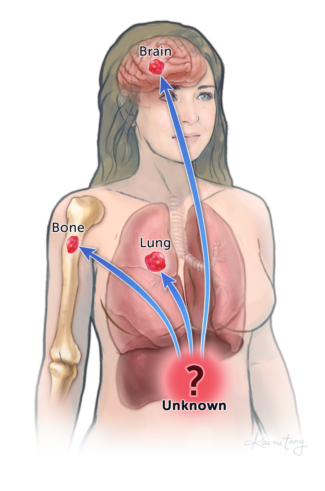
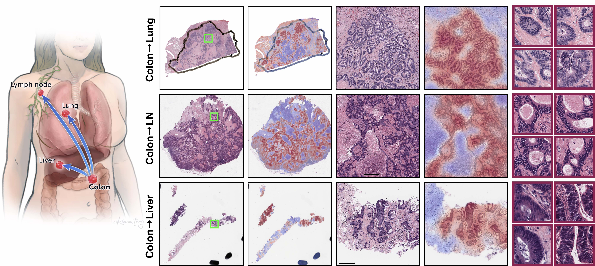

TOAD 🐸 
===========
### AI-based Pathology Predicts Origins for Cancers of Unknown Primary 
*Nature*

[Read Link](https://t.co/HTkIdg55Lw?amp=1) | [Journal Link](https://dx.doi.org/10.1038/s41586-021-03512-4) | [Interactive Demo](http://toad.mahmoodlab.org) 

*TL;DR: In this work we propose to use weakly-supervised multi-task computational pathology to aid the differential diagnosis for cancers of unknown primary (CUP). CUPs represent 1-2% of all cancers and have poor prognosis because modern cancer treatment is specific to the primary. We present TOAD (Tumor Origin Assessment via Deep-learning) for predicting the primary origin of these tumors from H&E images without using immunohistochemistry, molecular testing or clinical correlation. Our model is trained on 22,833 gigapixel diagnostic whole slide images (WSIs) from 18 different primary cancer origins and tested on an held-out set of 6,499 (WSIs) and an external set of 682 WSIs from 200+ institutions. Furthermore, we curated a large multi-institutional dataset of 743 CUP cases originiating in 150+ different medical centers and validated our model against a subset of 317 cases for which a primary differential was assigned based on evidence from extensive IHC testing, radiologic and/or clinical correlation.*

© This code is made available for non-commercial academic purposes. 

## TOAD: Tumor Origin Assessement via Deep-learning

## Pre-requisites:
* Linux (Tested on Ubuntu 18.04)
* NVIDIA GPU (Tested on Nvidia GeForce RTX 2080 Ti x 16)
* Python (3.7.7), h5py (2.10.0), matplotlib (3.1.1), numpy (1.18.1), opencv-python (4.1.1), openslide-python (1.1.1), openslide (3.4.1), pandas (1.0.3), pillow (7.0.0), PyTorch (1.5.1), scikit-learn (0.22.1), scipy (1.3.1), tensorflow (1.14.0), tensorboardx (1.9), torchvision (0.6).

### Installation Guide for Linux (using anaconda)
[Installation Guide](https://github.com/mahmoodlab/CLAM/blob/master/docs/INSTALLATION.md)

### Data Preparation
We chose to encode each tissue patch with a 1024-dim feature vector using a truncated, pretrained ResNet50. For each WSI, these features are expected to be saved as matrices of torch tensors of size N x 1024, where N is the number of patches from each WSI (varies from slide to slide). The following folder structure is assumed:
```bash
DATA_ROOT_DIR/
    └──DATASET_DIR/
         ├── h5_files
                ├── slide_1.h5
                ├── slide_2.h5
                └── ...
         └── pt_files
                ├── slide_1.pt
                ├── slide_2.pt
                └── ...
```
DATA_ROOT_DIR is the base directory of all datasets (e.g. the directory to your SSD). DATASET_DIR is the name of the folder containing data specific to one experiment and features from each slide is stored as .pt files.

Please refer to refer to [CLAM](https://github.com/mahmoodlab/CLAM) for examples on how perform this feature extraction step.

### Datasets
Datasets are expected to be prepared in a csv format containing at least 5 columns: **case_id**, **slide_id**, **sex**, and labels columns for the slide-level labels: **label**, **site**. Each **case_id** is a unique identifier for a patient, while the **slide_id** is a unique identifier for a slide that correspond to the name of an extracted feature .pt file. This is necessary because often one patient has multiple slides, which might also have different labels. When train/val/test splits are created, we also make sure that slides from the same patient do not go to different splits. The slide ids should be consistent with what was used during the feature extraction step. We provide a dummy example of a dataset csv file in the **dataset_csv** folder, named **dummy_dataset.csv**. You are free to input the labels for your data in any way as long as you specify the appropriate dictionary maps under the **label_dicts** argument of the dataset object's constructor (see below). For demonstration purposes, we used 'M' and 'F' for sex and 'Primary' and 'Metastatic' for the site. Our 18 classes of tumor origins are labaled by 'Lung', 'Breast', 'Colorectal', 'Ovarian', 'Pancreatobiliary', 'Adrenal', 'Skin', 'Prostate', 'Renal', 'Bladder', 'Esophagogastric',  'Thyroid', 'Head Neck',  'Glioma', 'Germ Cell', 'Endometrial', 'Cervix', and 'Liver'.

Dataset objects used for actual training/validation/testing can be constructed using the **Generic_MIL_MTL_Dataset** Class (defined in **datasets/dataset_mtl_concat.py**). Examples of such dataset objects passed to the models can be found in both **main_mtl_concat.py** and **eval_mtl_concat.py**. 

For training, look under main.py:
```python 
if args.task == 'dummy_mtl_concat':
    args.n_classes=18
    dataset = Generic_MIL_MTL_Dataset(csv_path = 'dataset_csv/dummy_dataset.csv',
                            data_dir= os.path.join(args.data_root_dir,'DATASET_DIR'),
                            shuffle = False, 
                            seed = args.seed, 
                            print_info = True,
                            label_dicts = [{'Lung':0, 'Breast':1, 'Colorectal':2, 'Ovarian':3, 
                                            'Pancreatobiliary':4, 'Adrenal':5, 
                                             'Skin':6, 'Prostate':7, 'Renal':8, 'Bladder':9, 
                                             'Esophagogastric':10,  'Thyroid':11,
                                             'Head Neck':12,  'Glioma':13, 
                                             'Germ Cell':14, 'Endometrial': 15, 
                                             'Cervix': 16, 'Liver': 17},
                                            {'Primary':0,  'Metastatic':1},
                                            {'F':0, 'M':1}],
                            label_cols = ['label', 'site', 'sex'],
                            patient_strat= False)
```
In addition to the number of classes (args.n_classes), the following arguments need to be specified:
* csv_path (str): Path to the dataset csv file
* data_dir (str): Path to saved .pt features for the dataset
* label_dicts (list of dict): List of dictionaries with key, value pairs for converting str labels to int for each label column
* label_cols (list of str): List of column headings to use as labels and map with label_dicts

Finally, the user should add this specific 'task' specified by this dataset object to be one of the choices in the --task arguments as shown below:

```python
parser.add_argument('--task', type=str, choices=['dummy_mtl_concat'])
```

### Training Splits
For evaluating the algorithm's performance, we randomly partitioned our dataset into training, validation and test splits. An example 70/10/20 splits for the dummy dataset can be fould in **splits/dummy_mtl_concat**. These splits can be automatically generated using the create_splits.py script with minimal modification just like with **main_mtl_concat.py**. For example, the dummy splits were created by calling:
 
``` shell
python create_splits.py --task dummy_mtl_concat --seed 1 --k 1
```
The script uses the **Generic_WSI_MTL_Dataset** Class for which the constructor expects the same arguments as 
**Generic_MIL_MTL_Dataset** (without the data_dir argument). For details, please refer to the dataset definition in **datasets/dataset_mtl_concat.py**

### Training
``` shell
CUDA_VISIBLE_DEVICES=0 python main_mtl_concat.py --drop_out --early_stopping --lr 2e-4 --k 1 --exp_code dummy_mtl_sex  --task dummy_mtl_concat  --log_data  --data_root_dir DATA_ROOT_DIR
```
The GPU to use for training can be specified using CUDA_VISIBLE_DEVICES, in the example command, GPU 0 is used. Other arguments such as --drop_out, --early_stopping, --lr, --reg, and --max_epochs can be specified to customize your experiments. 

For information on each argument, see:
``` shell
python main_mtl_concat.py -h
```

By default results will be saved to **results/exp_code** corresponding to the exp_code input argument from the user. If tensorboard logging is enabled (with the arugment toggle --log_data), the user can go into the results folder for the particular experiment, run:
``` shell
tensorboard --logdir=.
```
This should open a browser window and show the logged training/validation statistics in real time. 

### Evaluation 
User also has the option of using the evluation script to test the performances of trained models. Examples corresponding to the models trained above are provided below:
``` shell
CUDA_VISIBLE_DEVICES=0 python eval_mtl_concat.py --drop_out --k 1 --models_exp_code dummy_mtl_sex_s1 --save_exp_code dummy_mtl_sex_s1_eval --task study_v2_mtl_sex  --results_dir results --data_root_dir DATA_ROOT_DIR
```

For information on each commandline argument, see:
``` shell
python eval_mtl_concat.py -h
```

To test trained models on your own custom datasets, you can add them into **eval_mtl_concat.py**, the same way as you do for **main_mtl_concat.py**.



## Issues
- Please report all issues on the public forum.

## License
© [Mahmood Lab](http://www.mahmoodlab.org) - This code is made available under the GPLv3 License and is available for non-commercial academic purposes. 

## Reference
If you find our work useful in your research or if you use parts of this code please consider citing our paper:
```

@inproceedings{lu2020toad,
  title     = {Deep Learning-based Computational Pathology Predicts Origins for Cancers of Unknown Primary},
  author    = {Ming Y. Lu, Melissa Zhao, Maha Shady, Jana Lipkova,  Tiffany Y. Chen,  Drew F. K. Williamson, Faisal Mahmood},
  booktitle = {arXiv},
  year = {2020}
}
```
